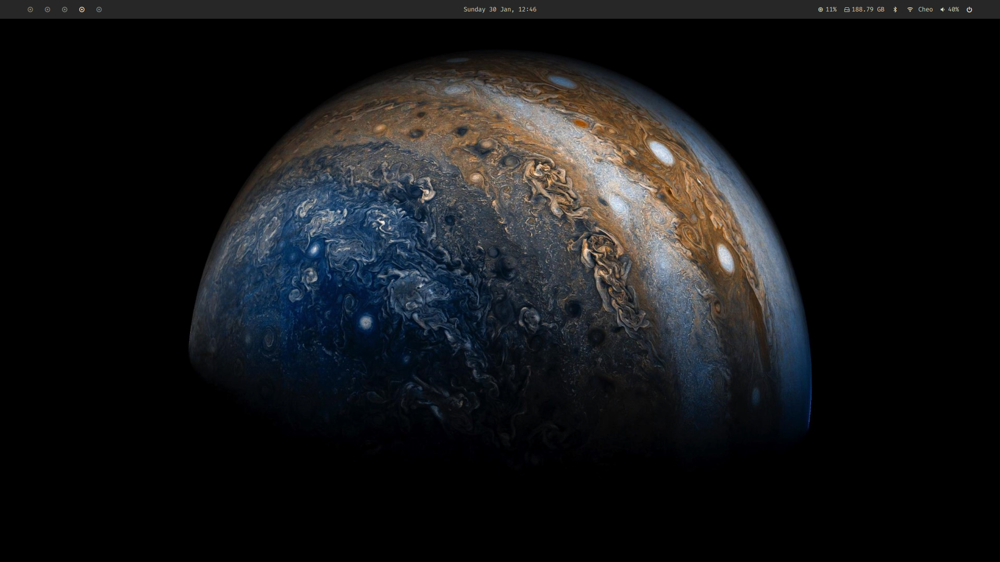
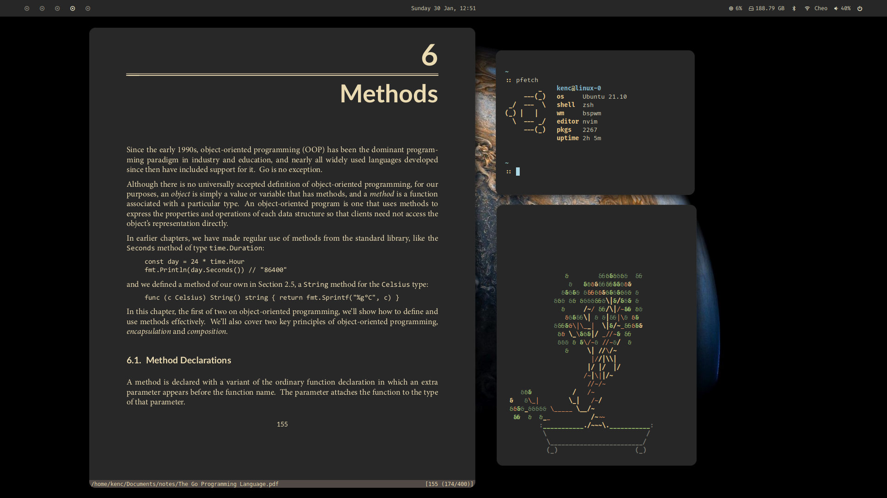
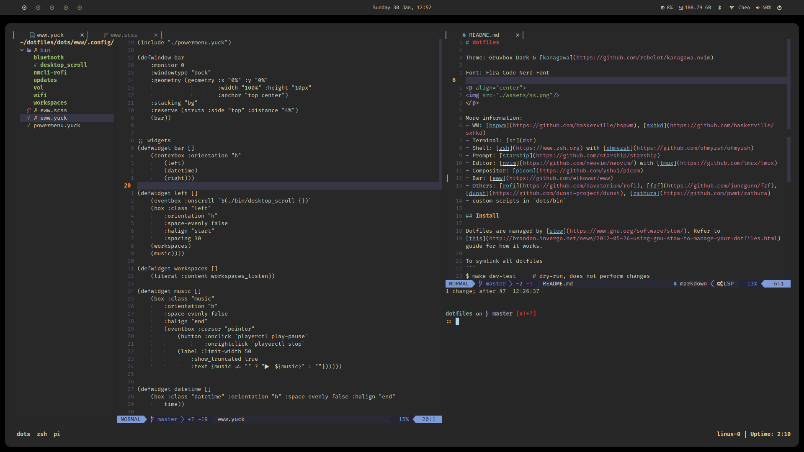
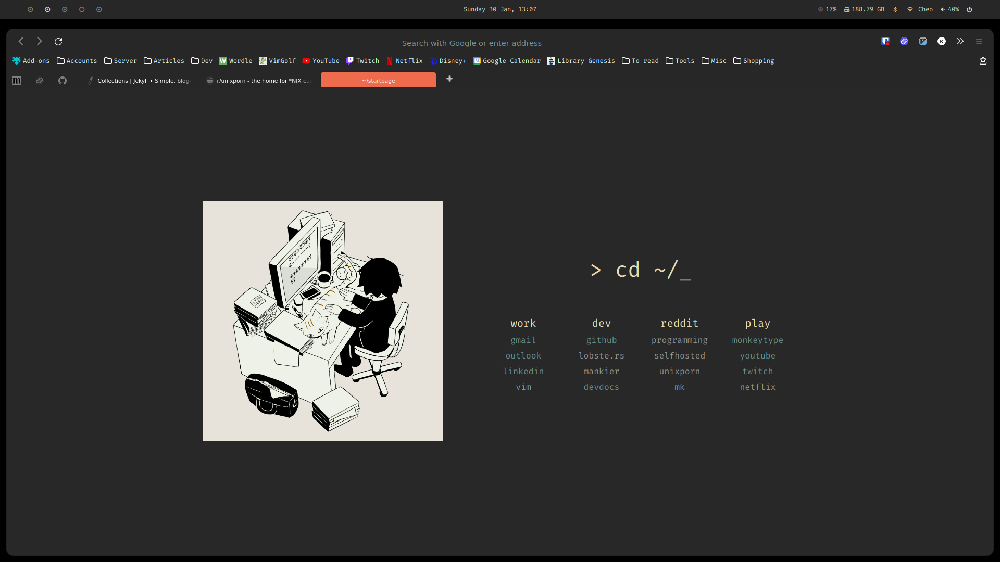

# dotfiles

Theme: Gruvbox Dark & [kanagawa](https://github.com/rebelot/kanagawa.nvim)

Font: Fira Code Nerd Font

<p align="center">
	
	
	
	
</p>

- WM: [bspwm](https://github.com/baskerville/bspwm)
- Terminal: [st](#st) fork
- Shell: [zsh](https://www.zsh.org) with [ohmyzsh](https://github.com/ohmyzsh/ohmyzsh)
- Prompt: [starship](https://github.com/starship/starship)
- Editor: [nvim](https://github.com/neovim/neovim/) with [tmux](https://github.com/tmux/tmux)
- Compositor: [picom](https://github.com/yshui/picom) fork
- Bar: [eww](https://github.com/elkowar/eww)
- Greeter: lightdm-gtk-greeter
- Others: [rofi](https://github.com/davatorium/rofi), [dunst](https://github.com/dunst-project/dunst), [zathura](https://github.com/pwmt/zathura)

## Install

Dotfiles are managed by [stow](https://www.gnu.org/software/stow/). Refer to
[this](http://brandon.invergo.net/news/2012-05-26-using-gnu-stow-to-manage-your-dotfiles.html) guide for how it works.

To symlink all dotfiles

```bash
$ make dev-test     # dry-run, does not perform changes
$ make dev
```

To sym a specified dir

```bash
$ make stow c=[dir]
```

### st
[Luke's](https://github.com/LukeSmithxyz/st) fork of st for an easy experience. Uses colors from `.Xresources` in `etc/.Xresources`.

Make edits to `config.h`. Compile and build with `sudo make install`.

## etc

### Colorscheme
Two colorschemes are available in the form of `.Xresources` files.

To use, copy the `.Xresources` file to `~/.Xresources` and replace the
defined path within it. Take care of the username.

### Binaries
Key binaries are listed in `/etc/stew` for installation with [stew](https://github.com/marwanhawari/stew).

```bash
$ stew install Stewfile.lock.json
```

### desktop
Desktop files for rofi access. Place them at `~/.local/share/applications/`

### Firefox Theme
Follow instructions at [SimpleFox](https://github.com/migueravila/SimpleFox).

### Custom browser startpage
See custom [startpage](https://github.com/kennethcheo/startpage)

### Greeter
The default LightDM greeter is used with a custom background. Config file is
found in `etc/lightdm-gtk-greeter.conf`. Replace the `background` field with the
correct img path.

```
$ sudo cp etc/lightdm-gtk-greeter.conf /etc/lightdm/lightdm-gtk-greeter.conf
$ sudo cp img/image.png /usr/share/backgrounds/image.png
```

Test with `dm-tool switch-to-greeter`.

## Remote
Minimal .vimrc config for remote servers

Requires installation of Gruvbox:

```bash
git clone https://github.com/morhetz/gruvbox.git ~/.vim/pack/default/start/gruvbox
```
